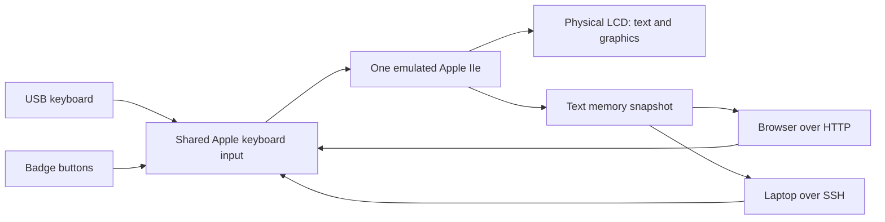

# How the badge becomes an Apple II

The Tufty runs one native RP2350 firmware built with the Pico SDK. Inside it,
**FRANK Apple** emulates an enhanced Apple IIe: a 65C02 CPU, memory banks, video,
keyboard, and disk controllers. Apple ROM code, DOS, BASIC, and applications run
as instructions on that emulated CPU.

This downstream builds on [rh1tech/frank-apple](https://github.com/rh1tech/frank-apple),
which incorporates the [MII emulator](https://github.com/buserror/mii_emu). We add
the Tufty/Pico hardware ports, storage integration, launcher, browser tools,
HTTP interface, and SSH. It runs directly on the microcontroller, without Linux
or MicroPython underneath.

## One Apple II, several ways to use it



All inputs affect the same program and memory. Connecting with SSH creates no
second Apple II. Disconnecting leaves it running. The HOME/F11/Ctrl-] device
menu pauses the emulated CPU while you choose a disk; the network still runs.

## What the two RP2350 cores do

| Core | Work |
| --- | --- |
| Core 0 | Run Apple CPU cycles; handle keyboard/buttons, disk access, and polled Wi-Fi/HTTP/SSH |
| Core 1 | Render Apple display memory and present the LCD framebuffer |

The RP2350 runs at 252 MHz in the supplied builds. Normal Apple emulation is
paced around the original 1.023 MHz clock. Work is divided into short main-loop
iterations; SSH is a state machine serviced by that loop, not a separate process.
LCD transfers use hardware peripherals/DMA. Flash programming temporarily parks
core 1 and uses flash-safe code so neither core executes unavailable flash.

## Where everything lives on Tufty

| Memory | Contents | Survives power-off? |
| --- | --- | --- |
| 520 KiB internal SRAM | 128 KiB Apple main/auxiliary RAM; emulator state; LCD buffers; active disk tracks; networking and stacks | No |
| 8 MiB external PSRAM | Fast working caches for the two mounted virtual floppies | No |
| First 4 MiB of flash | Firmware, Apple IIe ROM, character ROM, browser page and guide | Yes |
| Remaining 12 MiB of flash | FatFs data volume: disk images, configuration, SSH identity | Yes |

The Apple IIe ROM and character ROM are constant arrays read directly from
firmware flash. **PSRAM caches disk data, not ROM.** Each floppy's current BDSK
cache is 233,108 bytes (about 228 KiB); the two caches use about 455 KiB of the
8 MiB chip. This is a fixed layout, not an allocator using all available PSRAM.
The current SmartPort hard-disk path accesses FatFs directly; it has no PSRAM
hard-disk cache.

The Tufty LCD framebuffer is 320 × 240 at four bits per pixel: 38,400 bytes in
internal SRAM. The display driver expands scanlines to RGB565 for the LCD.
SSH reads the emulated text memory instead of scraping or transmitting pixels.

The custom **Pico 2 W** build uses an SD card for the data volume and streams
floppy tracks without Tufty PSRAM. The Apple, browser, SSH, and config behavior
are otherwise shared. See [hardware/wiring](HARDWARE.md).

## What happens when you SAVE

There are two filesystems involved:

```text
Tufty FAT data volume             Inside the emulated floppy
/                                Apple DOS catalog
├── wifi.ini                     ├── SSHDEMO (your BASIC program)
├── ssh.key                      └── OTHER PROGRAM
└── apple/
    ├── Workshop.dsk      ──────> original imported disk
    ├── Workshop.dsk.bdsk ──────> writable working disk used by the emulator
    └── autoboot.txt
```

1. `SAVE SSHDEMO` tells **Apple DOS** to put the program inside its virtual disk.
2. The emulated Disk II controller changes the active track in SRAM.
3. Head movement, drive changes, and motor-off flush dirty track data to the
   working `.bdsk` file and update the PSRAM cache.
4. FatFs synchronizes the file through the Tufty flash driver. The dirty flag
   clears only after a successful write and sync.

`CATALOG` lists files inside the Apple disk, not the badge's FAT directory.
The browser library lists the disk images themselves. Preserve `.bdsk` files
when backing up: they take precedence over the original imported images and
contain your changes. See [disk handling](DISKS.md).

Firmware-only updates stay below the data volume and preserve saved files.
A fresh-install image replaces that volume. PSRAM alone cannot preserve a save;
wait for disk activity to finish before [powering off](POWER.md).

## Networking lives outside the emulated Apple

The RP2350 firmware owns the Wi-Fi radio, lwIP TCP/IP stack, HTTP server/client,
and SSH transport. Apple software does not need an SSH or Wi-Fi driver.

- **SSH/browser typing:** firmware translates network input into Apple keys and
  returns a snapshot of the same text screen. [SSH internals](SSH-INTERNALS.md).
- **HTTP from BASIC:** a virtual network card in slot 1 exposes registers to the
  emulated CPU. Firmware performs the request and supplies the result. This is
  separate from the web controller. [BASIC HTTP commands](HTTP-GET.md).
- **Hotspot:** firmware starts the radio's WPA2 access point and a small DHCP
  service at `192.168.4.1`. It provides a local link, without Internet routing.
- **Settings:** `/wifi.ini` is read at boot. `/ssh.key` preserves this device's
  host identity between connections and firmware updates.

## Find the implementation

| Area | Start here |
| --- | --- |
| Main loop and shared input/text view | [src/main.c](../src/main.c) |
| Emulated CPU and memory banks | [src/mii.c](../src/mii.c), [src/mii_65c02.c](../src/mii_65c02.c) |
| Floppy tracks and working images | [src/mii_disk2.c](../src/mii_disk2.c), [src/disk_loader.c](../src/disk_loader.c) |
| SmartPort block storage | [src/mii_dd_stub.c](../src/mii_dd_stub.c) |
| Flash-backed FatFs | [drivers/flashdisk/flashdisk.c](../drivers/flashdisk/flashdisk.c) |
| PSRAM setup | [drivers/board_memory.c](../drivers/board_memory.c), [timing details](EXTERNAL_MEMORY.md) |
| Parallel LCD | [drivers/par_lcd.c](../drivers/par_lcd.c) |
| Network polling and virtual slot card | [src/mii_netcard.c](../src/mii_netcard.c) |

[Validation status](VALIDATION.md) separates host checks from physical-board tests.
