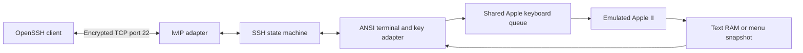

# How SSH works

The RP2350 terminates a real SSH-2 connection. After login, its terminal adapter
connects that channel to the existing Apple II keyboard and text view. The client
uses its usual `ssh` command; there is no host-side proxy or cloud service.
For connection steps, see [Use SSH](SSH.md).

## From a keystroke to the Apple



1. **Accept one connection.** The raw lwIP adapter handles TCP bytes. It leaves
   SSH parsing and cryptography to the main-loop poll, outside network callbacks.
2. **Negotiate and authenticate.** The server exchanges SSH identification and
   algorithms, performs key exchange, and accepts the configured password for
   user `apple`. It rejects input before authentication and channel setup.
3. **Attach a terminal.** OpenSSH requests a PTY and a `shell` channel. Here that
   request attaches to the Apple II; it does not spawn a shell process. Window
   changes update the text view's dimensions.
4. **Translate input.** Return, arrows, backspace, Escape, and Ctrl-C become Apple
   keys. Ctrl-] opens the device menu. Case is preserved; unsupported Unicode is
   ignored. The shared queue paces input to the Apple's one-byte keyboard latch.
5. **Return text.** Every 100 ms, the adapter can snapshot the 40/80-column text
   page or menu. It sends changed cells using ANSI cursor moves and inverse-video
   attributes. Graphics remain on the badge. No framebuffer is streamed over SSH.

## Keeping input reliable

The transport and terminal adapter use fixed-size buffers. SSH channel windows
limit how much keyboard data the client may send; window credit is returned as
the application consumes it. If the Apple typing queue fills, pending bytes wait
instead of being dropped. Ctrl-C cancels earlier queued input and reaches BASIC
before the remaining paste. A slow screen reader does not block keyboard handling.

TCP is a byte stream: packets can split SSH messages or combine several messages.
The adapter must retain unconsumed bytes and return receive credit only for bytes
it has accepted. Bounds, fragmented data, backpressure, and disconnect ownership
are covered by the transport tests.

A new session clears the old parser and terminal buffers and redraws the current
screen. A normal stdin EOF waits for queued typing to drain before closing.
Closing a connection never resets the emulated CPU or clears its program.

## Keys and encryption

| Purpose | Implementation |
| --- | --- |
| Key exchange | Curve25519 with SHA-256 |
| Device identity | Ed25519 host key |
| Transport encryption/authentication | AES-128-GCM |
| Login | Fixed username `apple`, password from `[ssh]` in `wifi.ini` |
| Randomness | Pico SDK `pico_rand`, backed by the RP2350 hardware random source |

On first SSH startup, firmware creates a host-key seed, writes it to a temporary
file, synchronizes it, and renames it to `/ssh.key`. A version and checksum detect
an unreadable/corrupted record. An existing invalid key disables SSH instead of
silently creating a new identity. Firmware/config updates preserve this file.
It is private key material, so do not copy it into public starter images.

The implementation adapts the permissively licensed **staticnet** SSH design and
crypto abstraction, with TweetNaCl for Ed25519/Curve25519 and the SDK's mbedTLS
for AES-GCM/SHA-256. Network integration, bounded parsing, and the Apple terminal
adapter live in this fork. [Provenance and local changes](../third_party/ssh/README.md)
list the exact upstream revision and component licenses.

## Deliberate limits

- One connection and one interactive channel; no separate Apple sessions.
- Password login; no user public-key login, forwarding, exec, SFTP, or SCP.
- Three failed passwords or a 60-second login timeout release the connection.
- A keepalive after 30 seconds without received SSH traffic detects lost peers;
  60 seconds without its reply closes the connection. Thinking at a prompt is fine.
- Rekey requests ask the client to reconnect. Sessions also end after 12 hours
  or 256 MiB of traffic; the running Apple remains intact.
- Text is a snapshot of the visible screen, not a terminal scrollback history.
  Cursor placement is approximate for applications with custom screen editing.

The firmware reserves a 12 KiB core-0 stack for crypto/HTTPS and a separate 2 KiB
video stack. Link checks enforce those reservations and minimum heap headroom.
Runtime heap/stack peaks remain unmeasured. Station-mode SSH and concurrent HTTPS
passed [physical tests](HARDWARE-VALIDATION-2026-10-05.md); hotspot timing is untested.

## Source and tests

| Module | Responsibility |
| --- | --- |
| [ssh_transport_lwip.c](../src/ssh_transport_lwip.c) | TCP listener, byte queues, pbuf ownership |
| [ssh_transport.cpp](../src/ssh_transport.cpp) | Protocol states, crypto, authentication, channel windows |
| [ssh_identity.c](../src/ssh_identity.c) | Persistent per-device host key |
| [ssh_terminal.c](../src/ssh_terminal.c) | Terminal key sequences, screen diffs, output pacing |
| [ssh_control.c](../src/ssh_control.c) | Config/menu lifecycle and shared Apple input/screen callbacks |

From a checkout with the [build prerequisites](BUILDING.md):

```sh
python3 tools/check-ssh-terminal.py
python3 tools/check-ssh-control.py
python3 tools/check-ssh-identity.py
python3 tests/test_ssh_transport.py --sdk "$PICO_SDK_PATH"
```

The last command builds the actual embedded engine on the host, connects with
stock OpenSSH, and runs malformed-input and real-lwIP-buffer checks under
ASan/UBSan. It does not emulate the radio or prove physical timing. See
[validation](VALIDATION.md) and the [overall architecture](HOW-IT-WORKS.md).
